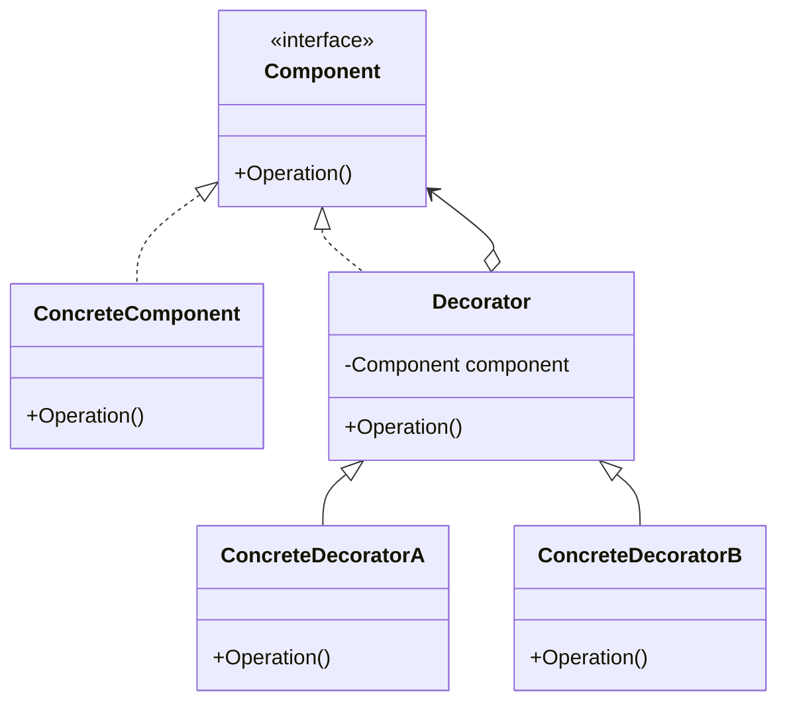
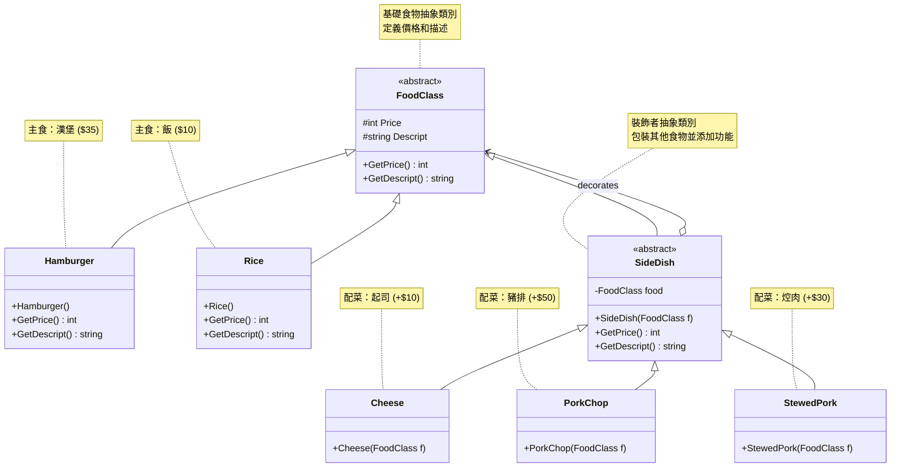

# Decorator Pattern (裝飾者模式)

## 介紹

Decorator Pattern 是一種結構型設計模式，它允許在不改變現有物件結構的情況下，動態地為物件添加新的功能。這個模式通過將物件包裝在裝飾者物件中來實現功能的擴展。

## 適用場景

- **需要在不影響其他物件的情況下，以動態、透明的方式給單個物件添加職責**
  - 例如：GUI組件添加邊框、滾動條、陰影等視覺效果
  - 例如：文字處理中為文字添加粗體、斜體、底線等格式
  
- **需要動態地撤銷某個物件的職責**
  - 例如：遊戲角色的臨時增益效果（攻擊力提升、防禦力增強）
  - 例如：網頁元素的動態樣式切換（主題切換、響應式設計）
  
- **當不能採用生成子類的方法進行擴充時**
  - 例如：第三方庫的類別無法修改，但需要擴展功能
  - 例如：需要大量組合的情況，避免類別爆炸問題（如本專案的餐點組合）

## 常見案例：.NET Core Web API 中的應用

在 .NET Core Web API 開發中，Decorator 模式經常被用於以下場景：

### 1. Middleware Pipeline（中介軟體管道）
```csharp
app.UseAuthentication();    // 身份驗證裝飾者
app.UseAuthorization();     // 授權裝飾者  
app.UseLogging();          // 日誌記錄裝飾者
app.UseErrorHandling();    // 錯誤處理裝飾者
```
每個中介軟體都是一個裝飾者，為HTTP請求處理添加特定功能。

### 2. Service Decorator（服務裝飾者）
```csharp
// 基本服務
public interface IUserService
{
    Task<User> GetUserAsync(int id);
}

// 快取裝飾者
public class CachedUserService : IUserService
{
    private readonly IUserService _userService;
    private readonly IMemoryCache _cache;
    
    public async Task<User> GetUserAsync(int id)
    {
        return await _cache.GetOrCreateAsync($"user_{id}", 
            async _ => await _userService.GetUserAsync(id));
    }
}

// 日誌裝飾者
public class LoggedUserService : IUserService
{
    private readonly IUserService _userService;
    private readonly ILogger _logger;
    
    public async Task<User> GetUserAsync(int id)
    {
        _logger.LogInformation($"Getting user {id}");
        var result = await _userService.GetUserAsync(id);
        _logger.LogInformation($"Retrieved user {id}");
        return result;
    }
}
```

### 3. Action Filter（動作篩選器）
```csharp
[Authorize]           // 授權裝飾者
[ValidateModel]       // 模型驗證裝飾者
[RateLimit]          // 流量限制裝飾者
[ApiVersion("1.0")]  // 版本控制裝飾者
public async Task<IActionResult> GetUsers()
{
    // 控制器邏輯
}
```

這些都是 Decorator 模式的實際應用，讓開發者可以靈活地組合不同的功能，而不需要修改核心業務邏輯。

## 基本Decorator架構圖



## 本專案熟食專賣店架構圖

